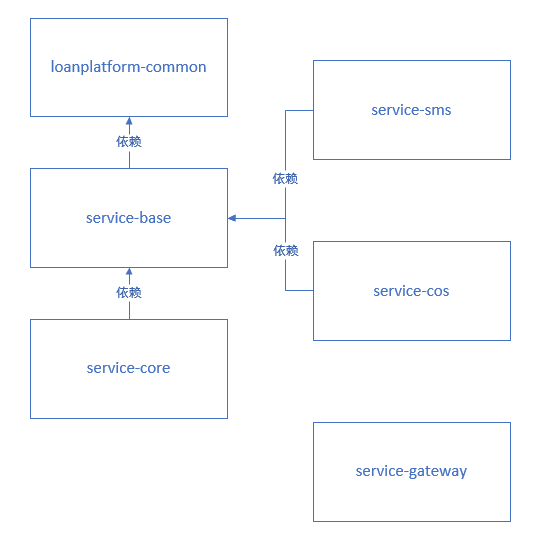

# LoanPlatform

##  一、简介

一个基于个人、小型企业打造的一款信用借款出借投资平台，门槛低、借款快、收益高，并具有一定灵活性。还款方式多样，以灵活的方式满足借款需求。

本平台使用第三方的汇付宝资金托管系统保障资金安全。

## 二、技术栈

### 1、后端

Spring Boot 2.6.3：搭建基础框架

Spring Cloud 2021.0.1：微服务基础设施 - 服务调用、微服务网关等

Spring Cloud Alibaba 2021.0.1.0：微服务基础设施 - 服务注册、服务发现、服务熔断等

MyBatis Plus 3.5.1：持久层框架

MyBatis Plus Generator 3.5.2：代码生成器

Lombok 1.18.22：简化实体类开发

Logback：日志系统

alibaba-easyexcel 3.1.0： Excel 读写

### 2、数据库和中间件

MySQL 5.7.34（或 8.0.28）：关系型数据库

druid 1.2.9：数据库连接池

Redis 6.2.6： 缓存

Spring Cache 2.6.3： Spring 项目缓存框架

### 3、三方接口

腾讯云短信：短信网关

腾讯云COS：对象存储

资金托管平台API对接：汇付宝（模拟）

### 4、前端（暂缺）

Node.js： JavaScript 运行环境

ES6：JavaScript的模块化版本

axios：一个发送Ajax请求的工具

Vue.js：web 界面的渐进式框架

Element-UI：前端组件库

模块化开发：解决javascript变量全局空间污染的问题

NPM：模块资源管理器

vue-element-admin：基于Vue.js的后台管理系统UI集成方案

NuxtJS：基于Vue.js构建的服务器端渲染应用的轻量级框架

## 三、工程结构

---- LoanPlatform

   ∟ loanplatform-common   [module]

   ∟ service-base      		[module]

   ∟ service-core      		[module]

   ∟ service-cos      		  [module]

   ∟ service-gateway       [module]

   ∟ service-sms      		 [module]




## 四、数据库创建

在版本 5.7.34（或 8.0.28）以上的 MySQL 数据库中创建名为`lp_service_core`的数据库，且设定字符集为`utf8mb4`，以及排序规则为`utf8mb4_unicode_ci`：

```mysql
# 注意！！！会删除原来的名为 lp_service_core 的数据库
DROP DATABASE IF EXISTS `lp_service_core`;
CREATE DATABASE `lp_service_core` CHARACTER SET utf8mb4 COLLATE utf8mb4_unicode_ci;
```

而后在`lp_service_core`数据库中运行项目根目录下的`lp_service_core_utf8mb4.sql`文件进行 15 张表的创建与初始化。

再将`service-core`模块中的配置文件`application-dev.yaml`内的 MySQL 配置修改正确，使应用能正确连接上面新建的数据库`lp_service_core`，如用户名、密码和URL参数。

同样需要修改`service-core`模块中的配置文件`application-dev.yaml`内的 Redis 配置以及`service-sms`模块中的配置文件`application-dev.yaml`内的 Redis 配置，使应用能正确连接并使用 Redis 服务器（6.2.6版本），如 host （ Redis 服务器 IP）、port （实际端口号）以及可能有的密码（未设置密码则不需要改密码）。

## 五、创建 Nacos 服务器

创建前需要在前面创建的 MySQL 数据库中创建名为`nacos`的数据库，且设定字符集为`utf8`，以及排序规则为`utf8_bin`，并在`nacos`的数据库中运行项目根目录下的`nacos-mysql.sql`文件。

```mysql
# 注意！！！会删除原来的名为 nacos 的数据库
DROP DATABASE IF EXISTS `nacos`;
CREATE DATABASE `nacos` CHARACTER SET utf8 COLLATE utf8_bin;
```

而后使用 docker 创建：

```bash
docker run -d \
-e MODE=standalone \
-e SPRING_DATASOURCE_PLATFORM=mysql \
-e MYSQL_SERVICE_HOST=host\
-e MYSQL_SERVICE_PORT=port \
-e MYSQL_SERVICE_USER=user \
-e MYSQL_SERVICE_PASSWORD=password \
-e MYSQL_SERVICE_DB_NAME=nacos \
-p 8848:8848 \
--restart=always \
--name nacos \
nacos/nacos-server:1.4.2
```

其中的环境参数含义为（详见 Nacos 官网）：

`MODE=standalone`指采用单机模式；

`SPRING_DATASOURCE_PLATFORM=mysql`指采用 MySQL 数据库作为配置中心的持久化数据库；

`MYSQL_SERVICE_HOST=host`中的 host 指对应 MySQL 数据库 IP；

`MYSQL_SERVICE_PORT=port`中的 port 指对应 MySQL 数据库服务端口号；

`MYSQL_SERVICE_USER=user`中的 user 指对应 MySQL 数据库用户名，通常为 root；

`MYSQL_SERVICE_PASSWORD=password`中的 password 指对应用户登录 MySQL 数据库所需要提供的密码；

`MYSQL_SERVICE_DB_NAME=nacos`中的 nacos 指在前面创建的名为`nacos`的数据库。

以上参数确认无误后即可在 docker 中运行命令创建 Nacos 服务容器。

运行成功后，还需要修改四个模块（`service-core`、`service-cos`、`service-gateway`、`service-sms`）中的`application.yaml`配置文件内的 Nacos 配置，将`server-addr`的值改为当前的 Nacos 服务器所在 IP 地址和应用端口号。

## 六、其他

本项目使用了腾讯云的对象存储和短信服务，涉及到相应的关键常量已在`service-cos`、`service-sms`中的配置文件`application-dev.yaml`内展示，进行相应的修改即可。

运行项目时保证 MySQL 和 Nacos 服务器已创建并运行中后，先运行`service-gateway`模块，而后是`service-core`模块，最后运行`service-cos`、`service-sms`模块。

本项目为 Demo 版本，仅为模拟信用借款出借投资平台，并模拟了汇付宝服务。

